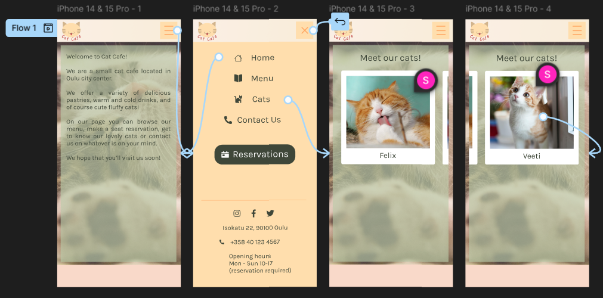

# Project Plan - Cat Cafe website

## Brief plan of the site

For my final project I decided to make a website for an imaginary cat cafe. Inspiration for the website has been drawn from Pokémon Cafes located in Japan.

The site is going to consist of few views:

1. Homepage
	- Landing page, where a short introduction of the cafe is shown
2. Menu
	- Cafe's menu with the menu items and few photos
3. Cats
	- A carousel of the cats residenting in the cafe
	- If I have time, I'll add functionality that allows the user to see more information about the cats by clicking their images on the carousel
4. Contact Us
	- A contact page where the usual address and contact information is shown
	- Also a feedback form where the users can leave feedback or contact the cafe
5. Reservations
	- A form with a date picker to make seat reservations to the cafe
	
Logo of the Cat Cafe was done by me in Inkscape for Exercise 8, the pictures of the cats (at least in the prototype) are from [Pexels](https://pexels.com) (page for free stock photos and royalty free images).
	
## Prototype

[Link to prototype](https://www.figma.com/proto/3UOgESpUChZTmeKVBK5aVh/Cat-Cafe?node-id=1-2&t=LNPl1S9vMRM7dx9C-1&scaling=scale-down&content-scaling=fixed&page-id=0%3A1&starting-point-node-id=1%3A2)

For the prototype I made views of the homepage, the navigation menu in mobile view and 'Meet our cats' page. In the prototype navigation can be done through the hamburger menu, both in homepage and cats page, and the navigation menu can be closed by pressing the X (when navigation menu is open). Both 'Home' and 'Cats' links are pressable. In the 'Meet our cats' page, there are two pictures in the mockup carousel that can be dragged.

In desktop view I planned the website to look like this:

## Technologies

In addition to HTML and CSS I plan to use either Bootstrap or Tailwind as the CSS library. I have already have some experience with Bootstrap, so it would be nice to try Tailwind as a new library.